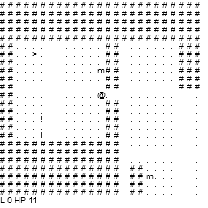

# Mines of Crypto Roguelike JS1K 2018 Development

I knew that a simple roguelike was possible having produced one for
[JS1k 2010](http://js1k.com/2010-first/demo/769)

Although the 2010 entry was a full game, with win and lose mechanics, level
progression etc I was never entirely happy with it

What I really wanted this time was a roguelike that felt like a roguelike

I particularly wanted a better dungeon generator this time around, and for it
to use classic roguelike graphics, eg this kind of thing:

```
###########   #######
#....!....#####.m...#
#.@...............>.#
#......!..#####.....#
###########   #######
```

My process this time around was:

- Made a desired feature list
- Implemented each feature then checked minified+packed size
- Golfed promising features until they fitted in 1k, or abandoned if it seemed
  undoable

I used [branches](https://github.com/nrkn/js1k-2018-roguelike/branches/active)
to try out new features, which was great as I could try out different
combinations of features through merges etc

## Features

Initially I made a list of features that I wanted - I knew that not all of them
would be possible in 1k, and that I'd have to prioritise:

- ✔️ decent dungeons that look like dungeons
- ️️️✔️ monsters and combat
- ✔️ multiple dungeon levels with difficulty progression
- ✔️ healing potions
- ✔️ win if reach bottom
- ✔️ fov
- ✔️ colors
- move up and down stairs
- multiple monster types
- emoji instead of ascii
- weapons/armor
- win if reach bottom and return to top
- gold
- shop (level 0) - only fun if weight limit on carrying items and can sell then
  use money to buy better armour, weapons

Some features were tried out quickly and then abandoned, such as emoji - all the
decent emoji that I wanted to use for variously elements added multiple bytes
to the code due to being quite deep into the unicode range. Others that seemed
promising got a branch. Others, like inventory and shop were pipe dreams that
would have been great but were realistically never going to fit in 1k.

### Decent Dungeons

I played with [BSP](http://www.roguebasin.com/index.php?title=Basic_BSP_Dungeon_generation)
and was able to do a decent BSP dungeon generator with the player `@` walking
around, but with very few bytes left over

I abandoned this approach before even making my initial commit, and went with
a looser dungeon generation algorithm that didn't care so much about overlapping
rooms etc. but still ensured connectivity between all points in the dungeon -
this actually created more interesting levels because overlapping rooms in
practise create all kinds of interesting room shapes.



I was quite happy with this generator and went on to add a few more features
before later dumping it in favour of a cave algorithm to save more bytes

[Branch for dungeons with rooms](https://github.com/nrkn/js1k-2018-roguelike/tree/dungeon-rooms)

The cave algorithm used by the final version uses a modified drunkard's walk
algorithm to tunnel out caverns while ensuring connectivity

### Monsters and combat

One of the first features implemented, it really had to be in there for it to
be a roguelike. Compared to the algorithm used in my 2010 entry, these monsters
are a lot dumber in the way they try to move towards the player, but lots of
bytes were saved

### Multiple dungeon levels with difficulty progression

Implemented by having base constants for number of rooms, number of monsters etc
and then adding a random amount more based on the current level number

### Healing potions

Styled as coins to fit the theme - some levels have more monsters than coins
and some more coins than monsters to keep things interesting

### Win if reach bottom

When the player reaches the bottom level, instead of stairs going down, there's
an item you can get to win - I used `$` to fit the theme

### FOV

The field of view algorithm isn't just to add visual interest, it also helps the
player keep track of where they've already been on bigger levels - otherwise
these are very frustrating to navigate

### Colors

Expensive in terms of bytes, but really make a huge difference to the aesthetic,
as well as user experience in helping the player easily distinguish the
different elements in the dungeon

### Move up and down stairs

This was a step towards a later goal, which is following the roguelike trope of
having to first descend the dungeon, then find the goal item, retrieve it, and
ascend back to the top. Ultimately abandoned due to lack of spare bytes, but
[retained in a branch](https://github.com/nrkn/js1k-2018-roguelike/tree/stairs-up)

### Multiple monster types

Would have used different letters, introduced as the player descended, with
extra HP. Never implemented.

### Emoji instead of ASCII

Tried it out briefly - even with only the handful of emoji needed for the game
elements it blew the byte count out severely due to most of the cool emoji being
deep into the Unicode range and therefore requiring several bytes each

Didn't even get its own branch

### Weapons/Armor

Would've probably been implemented by having something like `W10 A10` in the
status bar and randomly scattering weapon and armor boosts around the level that
increased each value. The combat algorithm would also have had to be more
complex to handle these, and would definitely need the multiple monster types
feature to keep the game balanced. Would've been a great feature but seemed like
it was going to be very expensive so was never implemented.

### Win if reach bottom and return to top

See **Move up and down stairs** above. Never implemented.

### Gold

This was sort of implemented in making coins the same thing as HP but originally
it was going to be a random drop from monsters that you collected to use in the
shop, also not implemented.

### Shop

This would have been the holy grail for 1k - it would require the weapons and
armour feature, except expanded to instead of just being weapon and armor
boosts, actually having different types of weapons and armor, otherwise there's
no point to a shop. It would require some kind of weight management - part of
the fun of shops in roguelikes is descending into the dungeon, filling up your
pack, then hauling your loot back to the shop, hoping to sell it for enough to
get that next great weapon/armor/whatever. Way too many bytes for all the things
it would need, but an admirable goal 😂

## Golfing strategy

I was very impressed by the current version of [uglify](https://github.com/mishoo/UglifyJS2)
as it creates minified code very close to what I could golf by hand - especially
because you can tweak the uglify settings to more closely match how you would
hand-golf something. I made very few changes to the minified code before
packing.

This year I wanted to write my uncompressed source to be as readable as
possible, using lots of constants and clear naming as I knew the minifier would
remove that for me. I think I have one of the most readable uncompressed sources
of any entry this year.

I then used the excellent [RegPack](http://siorki.github.io/regPack.html) to
reduce the byte count further. I ran into some issues this year with what
appears to be a [Chrome eval bug](https://github.com/Siorki/RegPack/issues/81),
which I managed to work around.

My golfing strategy has evolved a lot from earlier years where I spent a large
part of the development time on meticulously golfing everything by hand before
handing it over to the packer.

This time I wrote code to be as clear and readable as possible so I could focus
on more easily adding interesting features, rather than spending a lot of time
golfing by hand. It's much easier to work on simple, clear code, especially when
doing refactors. Instead of hand golfing, I relied on my knowledge of how the
minifier and packer work to write code that minifies and packs well.
